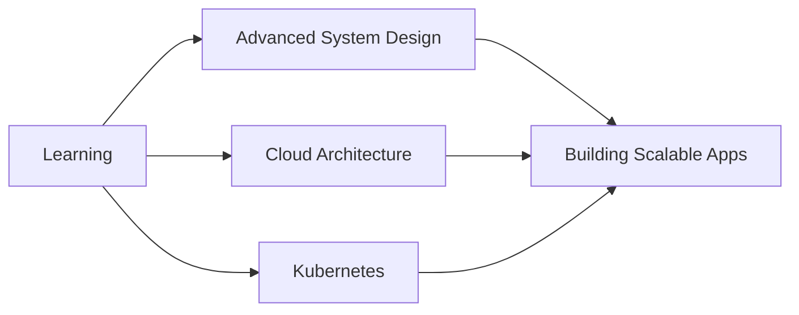

<p align="center">
  
</p>

<h1 align="center">
  
</h1>

<div align="center">
  
  <a href="https://github.com/notsopreety?tab=followers">
    
  </a>
  
  
</div>

<br/>

<div align="center">
  
</div>

---

## 👨‍💻 About Me

```javascript
const samir = {
    location: "Kathmandu, Nepal 🇳🇵",
    role: "Backend Developer & API Architect",
    code: ["JavaScript", "TypeScript", "React" "Python", "PHP", "C"],
    askMeAbout: ["web scraping", "automation", "bot development", "API design", "server optimization"],
    technologies: {
        backend: {
            js: ["Node.js", "Express.js", "NestJS"],
            python: ["Flask", "FastAPI", "Scrapy"]
        },
        databases: ["MongoDB", "MySQL", "PostgreSQL", "Redis"],
        devOps: ["Docker", "Git", "Linux", "Bash", "PM2"],
        tools: ["Postman", "VS Code", "Puppeteer", "Playwright"]
    },
    currentFocus: "Building scalable backend systems and intelligent automation solutions",
    funFact: "I debug with console.log() and I'm not ashamed! 😄",
    secret: "I am noob who do slavery of AI to write codes 😂"
};
```

---

## 🚀 What I Do

<table>
<tr>
<td width="50%">

### 🔧 Backend Development
- RESTful & GraphQL API Design
- Microservices Architecture
- Database Optimization & Design
- Authentication & Authorization
- Real-time WebSocket Applications

</td>
<td width="50%">

### 🤖 Automation & Scraping
- Web Scraping Solutions
- Bot Development (Whatsapp, Telegram, Discord)
- Task Automation Scripts
- Data Collection & Processing
- Browser Automation

</td>
</tr>
</table>

---

## 🛠️ Tech Stack

### Languages
<div align="center">
  
  
  
  
  
  
</div>

### Backend & Frameworks
<div align="center">
  
  
  
  
  
</div>

### Databases
<div align="center">
  
  
  
  
</div>

### Tools & Technologies
<div align="center">
  
  
  
  
  
</div>

---

## 📊 GitHub Statistics

<div align="center">
  
  
</div>

<div align="center">
  
  
</div>

---

## 🏆 GitHub Achievements

<div align="center">
  
</div>

---

## 💼 Key Expertise

<details>
<summary>🔹 <b>API Development</b></summary>
<br>
<ul>
  <li>RESTful API design and implementation</li>
  <li>GraphQL API development</li>
  <li>API authentication (JWT, OAuth)</li>
  <li>Rate limiting and security best practices</li>
  <li>API documentation with Swagger/OpenAPI</li>
</ul>
</details>

<details>
<summary>🔹 <b>Web Scraping & Automation</b></summary>
<br>
<ul>
  <li>Dynamic content scraping with Puppeteer/Playwright</li>
  <li>Anti-bot bypass techniques</li>
  <li>Data extraction and processing pipelines</li>
  <li>Scheduled automation with cron jobs</li>
  <li>Proxy rotation and session management</li>
</ul>
</details>

<details>
<summary>🔹 <b>Database Management</b></summary>
<br>
<ul>
  <li>MongoDB aggregation and optimization</li>
  <li>MySQL query optimization</li>
  <li>Database schema design</li>
  <li>Data migration strategies</li>
  <li>Redis caching implementation</li>
</ul>
</details>

<details>
<summary>🔹 <b>Bot Development</b></summary>
<br>
<ul>
  <li>Discord bot development with Discord.js</li>
  <li>Telegram bot creation</li>
  <li>Automated task bots</li>
  <li>Web scraping bots</li>
  <li>Chat automation solutions</li>
</ul>
</details>

---

## 🎯 Current Focus



- 🔭 Working on scalable microservices architectures
- 🌱 Learning advanced DevOps and cloud technologies
- 👯 Looking to collaborate on open-source projects
- 💬 Ask me about Node.js, API development, and web scraping
- ⚡ Fun fact: I can probably automate it with a script!

---

## 📝 Latest Blog Posts

<!-- BLOG-POST-LIST:START -->
- Coming soon! Building my technical blog 📝
<!-- BLOG-POST-LIST:END -->

---

## 🎮 When I'm Not Coding

<div align="center">
  
| 🎬 Watching | 🎮 Gaming | 📚 Reading | ☕ Coffee |
|:--------:|:---------:|:----------:|:---------:|
| Anime & Movies | AOV & Minecraft | Tech blogs & Mangas | Always brewing |

</div>

---

## 🔎 Discord Status

<div align="center">
  <a href="https://discord.com/users/931511745284038696">
    
  </a>
</div>

---

## 📬 Connect With Me

<div align="center">
  <a href="https://twitter.com/notsopreety" target="_blank">
    
  </a>
  <a href="https://www.linkedin.com/in/samirbadaila" target="_blank">
    
  </a>
  <a href="https://discord.com/users/931511745284038696" target="_blank">
    
  </a>
  <a href="https://www.reddit.com/user/notsopreety/" target="_blank">
    
  </a>
  <a href="https://fb.com/dev.samir.xyz" target="_blank">
    
  </a>
  <a href="https://instagram.com/samirxyzz" target="_blank">
    
  </a>
</div>

---

## 💡 Random Dev Quote

<div align="center">
  
</div>

---

## 📊 Weekly Development Breakdown

<!--START_SECTION:waka-->
<!-- Wakatime stats will go here -->
<!--END_SECTION:waka-->

---

<div align="center">
  
### 💭 Philosophy

  <i>"Code is like humor. When you have to explain it, it's bad."</i>
  
  <i>"Turning caffeine into code, one commit at a time. ☕🚀"</i>
  
  [](https://samirbadaila.com.np)
  [](https://samirxyz.info/)
  
</div>

---

<div align="center">
  
</div>

---

<div align="center">
  <b>⭐️ From <a href="https://samirxyz.info/">Samir Badaila</a> | Let's build something amazing together! 🚀</b>
</div>

<p align="center">
  
</p>
